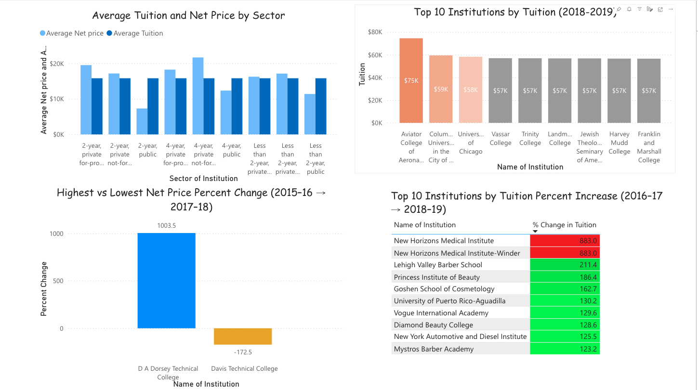
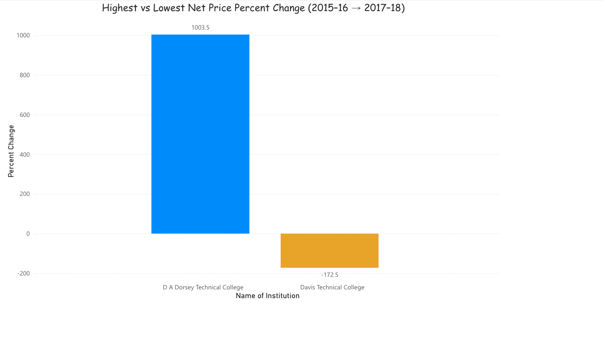
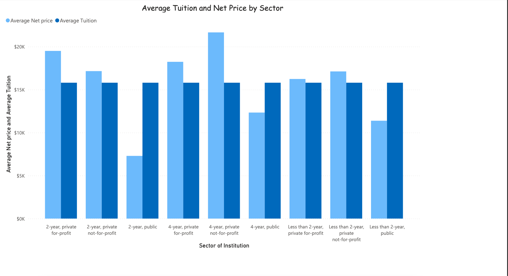
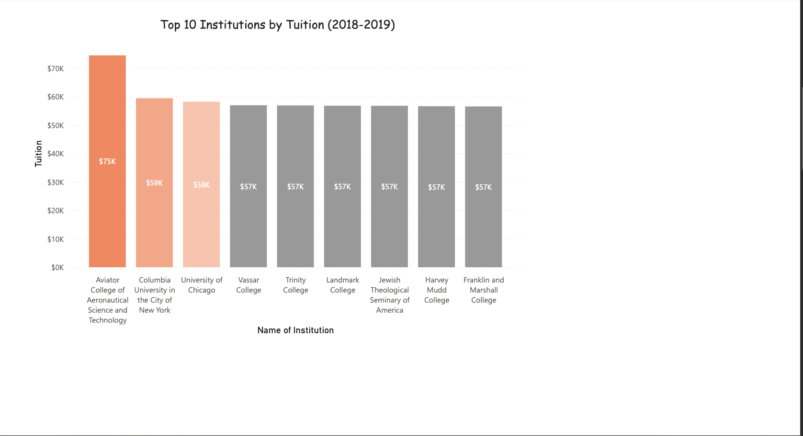
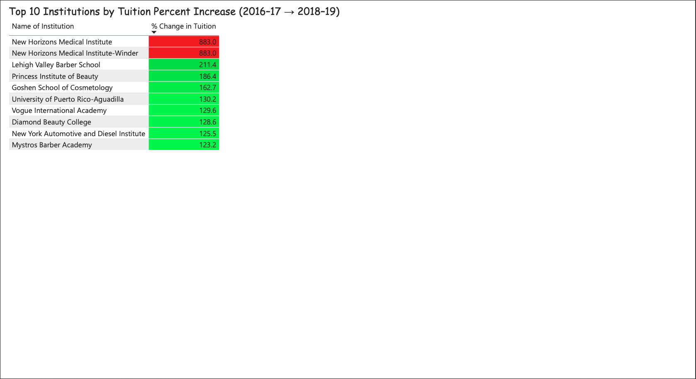

## Tuition Price Modernization Dashboard 🎓📊

## Overview
This project modernizes tuition pricing data from multiple U.S. institutions to make it clean, structured, and analysis-ready. I began by thoroughly reviewing and formatting raw data, identifying major issues with null values and inconsistent file formats. The goal was to improve data quality, create accurate relationships, and build interactive dashboards for tuition insights and trends.

## Tools & Technologies
Power BI • Power Query • Power Pivot • Excel (.xlsx) • Data Modeling & Data Cleaning

## Data Preparation & Transformation
- **Null handling:** Cleaned nulls across several columns and created a **unique key** by combining `User ID` and `Open ID`, enabling reliable relationships in Power Pivot.
- **Format standardization:** Converted CSVs to **.xlsx** to stop fields being cut off during import and ensure consistent loads.
- **Data types:** Standardized most fields as text; formatted numeric columns (percent change, tuition fees) as whole numbers or rounded to one decimal.
- **Merged file for Power BI:** Produced a clean, easy-to-load merged file for Power BI.

## Visuals Included
1) **Highest vs Lowest % Change (2015–2018)**  
2) **Average Institution Net Price by Sector**  
3) **Top 10 Institutions by Net Price (2018–2019)**  
4) **Top 10 Institutions by Tuition % Increase (2016–2019)**

## Outcomes
- Improved **data quality (~40%)** via transformations + unique key strategy.
- Enabled accurate relationships in Power Pivot/Power BI.
- Eliminated CSV import truncation by standardizing to .xlsx.
- Delivered interactive visuals for fast tuition trend exploration.

## Repository Map
- `PowerBI.pbix` — Power BI dashboard
- `data/cleaned_tuition_data.xlsx` — Final cleaned dataset used for analysis
- `data/tuition_raw_data.zip` — Zipped version of original/raw dataset
- `reports/` — Dashboard screenshots
- `README.md` — Project documentation

## Dashboard Preview

## 🔎 Keywords
`Power BI` `Power Query` `Power Pivot` `Data Modernization` `Data Quality` `Data Modeling` `Data Visualization` `Business Intelligence` `Tuition Analytics`
